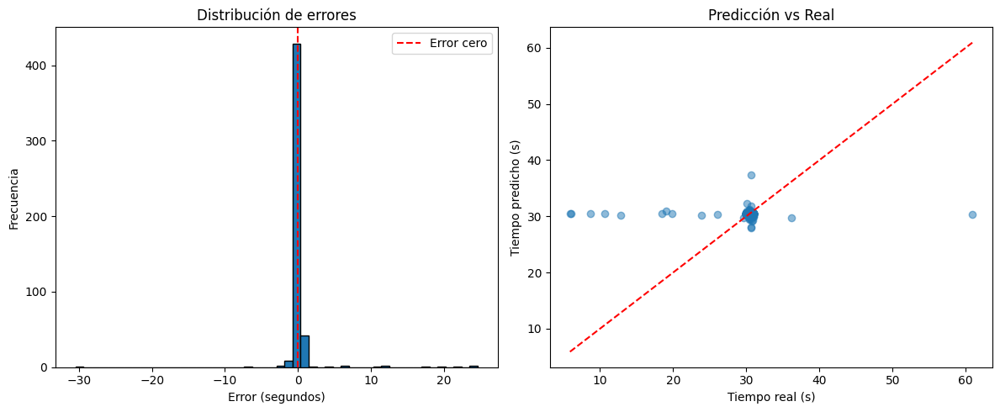

# SeismicWaves

A deep learning project for P-wave arrival time detection in seismic signals using CNN and Wavelet transforms.

## Results Model: 


Métricas de rendimiento en conjunto de prueba:
- MAE: 0.6786 segundos
- RMSE: 2.8132 segundos

Estadísticas de errores:
- Error medio: 0.1754 segundos
- Desviación estándar: 2.8077 segundos
- Mediana del error: -0.0529 segundos
- Error dentro de ±0.5s: 85.3%
- Error dentro de ±1.0s: 95.8%

*file:* src/models/augmented_ranges_huber_data.keras

*notebook*: is notebooks/07_training_final.ipynb

*dataset used: data/data_model, where is (train, val, and testing dataset), are diveded by /augmented what is the original data augmented and the directory /augmented_ranges where is the data augmented but using ranges, one better aproach than the augmented original data. 
[data_set_model](https://drive.google.com/drive/folders/1dzXh-x6RpQ3i-LQx9NOz3-NoqaTZ3uqG?usp=sharing)

**results over dataset:** augmented_ranges_huber_data.csv

## Results testing set vt_p_test

csv_seconds: [[predictions_eval.csv]]
csv_timestamps: [[predictions_timestamps.csv]]

## Project Overview

This project implements a hybrid deep learning approach combining Convolutional Neural Networks (CNNs) and Wavelet transforms to automatically detect P-wave arrival times in seismic signals. The model processes raw seismic waveform data to make precise predictions of when the P-wave arrives at the seismic station.

### Key Features

- Automated P-wave arrival time detection
- Hybrid architecture combining CNN and Wavelet features
- Pre-processing pipeline for seismic signals
- Support for MSEED seismic data format
- Data augmentation techniques for improved generalization
- Evaluation metrics and visualization tools

## Project Structure

```bash
cnn_wavelets_project/
├── data/                       ← Archivos .mseed, .csv, .npz, etc.
│   ├── raw/                    ← Datos originales
│   └── processed/              ← Datos filtrados, normalizados, recortados
│
├── notebooks/                 ← Pruebas y visualizaciones rápidas
│   └── 01_visualizacion.ipynb
│
├── src/                       ← Código fuente principal
│   ├── preprocessing/         ← Wavelets, normalización, padding, etc.
│   │   ├── wavelet_transform.py
│   │   ├── mseed_loader.py
│   │   └── utils.py
│   │
│   ├── models/                ← Arquitecturas de redes
│   │   └── cnn_wavelet_model.py
│
├── requirements.txt           ← Librerías necesarias
├── config.yaml / config.py    ← Parámetros de entrenamiento
└── README.md                  ← Descripción del proyecto

```

## Components

### Data Processing

- **Raw Data**: Original MSEED files containing seismic waveforms and arrival time annotations
- **Processing Pipeline**: 
  - Signal normalization using Z-score
  - Butterworth bandpass filtering (7-19 Hz)
  - Wavelet feature extraction
  - Data augmentation for training

### Model Architecture

The project uses a hybrid approach:
1. **CNN Branch**: Processes raw seismic signals
2. **Wavelet Branch**: Extracts frequency-domain features
3. **Combined Network**: Merges both branches for final prediction

### Training Pipeline

- Data split into train/validation/test sets
- Loss function: Huber Loss for robust regression
- Performance metrics: MAE, MSE
- Model checkpointing and early stopping

## Usage

is in uning the model:(/notebooks/08_generalization.ipynb]) is just select the directory and generete the wavelet features what are in wavelets features: (notebooks/05_wavelets+cnn.ipynb) for the dirctory before the process of the normalize and filtered the data clean the data: (notebooks/02_clean_data.ipynb)


## Requirements

- Python 3.12+
- TensorFlow 2.x
- ObsPy (for seismic data handling)
- NumPy, Pandas
- PyWavelets
- Matplotlib (for visualization)

## Notebooks

1. `01_view_study.ipynb`: Data exploration and visualization
2. `02_clean_data.ipynb`: Data cleaning and preprocessing
3. `03_organize_data.ipynb`: Dataset organization
4. `04_data_augmentation.ipynb`: Data augmentation techniques
5. `05_wavelets+cnn.ipynb`: Model architecture and feature extraction
6. `06_training.ipynb`: Training experiments
7. `07_training_final.ipynb`: Final model training
8. `08_generalization.ipynb`: Model generalization tests

## Results

The model achieves accurate P-wave arrival time predictions with the following metrics:
- Mean Absolute Error (MAE): < 1 second
- Model generalizes well to unseen seismic events
- Robust performance across different signal qualities

## Future Work

- Implement real-time prediction capabilities
- Extend support for different seismic phases
- Enhance data augmentation techniques
- Explore transfer learning approaches

## License

This project is licensed under [LICENSE]
